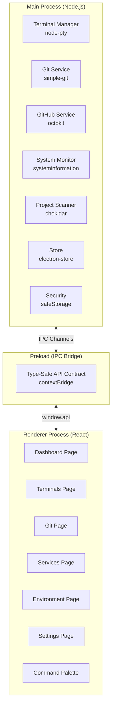

# ProjectYB — Desktop Project Manager

A sleek, dark-themed Electron desktop app for managing all your coding projects under `D:\Code`. One place to run services, manage terminals, handle git operations, interact with GitHub, monitor system resources, and launch into development instantly.


---

## Tech Stack

| Layer | Technology | Purpose |
|-------|-----------|---------|
| Desktop Framework | **Electron 35** + **electron-vite 5** | Chromium-based desktop app with Vite HMR |
| Frontend | **React 19** + **TypeScript 5.7** | Component-based UI |
| Styling | **Tailwind CSS v4** + **shadcn/ui** | Dark theme, Radix primitives |
| State | **Zustand 5** | Lightweight reactive state management |
| Terminals | **@xterm/xterm 6** + **node-pty 1.1** | Real embedded terminals |
| Git | **simple-git 3.36** | Full local git operations |
| GitHub API | **@octokit/rest 22** | Create repos, manage issues/PRs |
| Persistence | **electron-store 11** | JSON config & state persistence |
| Monitoring | **systeminformation 5** | CPU/RAM/Network per process |
| File Watching | **chokidar 5** | Project directory scanning |
| UI Extras | **cmdk**, **sonner**, **lucide-react**, **motion**, **react-resizable-panels** | Command palette, toasts, icons, animations, split panes |
| Package Manager | **pnpm** | You already use it |

---

## User Review Required

> [!IMPORTANT]
> **Phased delivery approach.** This is a massive app. I propose building it in 4 phases so you get a usable app fast, then we iterate. Phase 1 gives you the core (project dashboard + terminal manager + service runner) — the stuff that solves your immediate "7 terminals open" problem. Each subsequent phase adds more power.

> [!WARNING]
> **Native module compilation.** `node-pty` requires C++ build tools. You'll need Visual Studio Build Tools with the "Desktop development with C++" workload installed (or `npm install --global windows-build-tools`). We'll verify this during setup.

> [!IMPORTANT]
> **GitHub PAT.** For the GitHub integration, you'll need to generate a Personal Access Token with `repo`, `read:org`, and `workflow` scopes. The app will encrypt and store it securely using Electron's `safeStorage` (backed by Windows DPAPI).

---

## Resolved Decisions

- **Scan paths:** Default `D:\Code`, fully configurable — users can add/remove any root directories in Settings.
- **Project templates:** Extensive built-in library (Next.js, Discord.js, Python, Express, Fastify, Electron, Tauri, React, Svelte, Flask, FastAPI, Rust CLI, Go API, etc.) + custom user templates.
- **Startup behavior:** Auto-restore — automatically restart all previously running services on app launch.

---

## Proposed Changes

### Architecture Overview



### File Structure

```
D:\Code\Repositories\Project-Manager\
├── electron.vite.config.ts          # Build config for main/preload/renderer
├── package.json
├── tsconfig.json
├── tsconfig.node.json
├── tsconfig.web.json
│
├── resources/                        # App icons, assets
│   └── icon.png
│
├── src/
│   ├── main/                         # Main process (Node.js)
│   │   ├── index.ts                  # App entry, window creation
│   │   ├── ipc/                      # IPC handler registrations
│   │   │   ├── terminal.ipc.ts
│   │   │   ├── git.ipc.ts
│   │   │   ├── github.ipc.ts
│   │   │   ├── projects.ipc.ts
│   │   │   ├── system.ipc.ts
│   │   │   └── store.ipc.ts
│   │   ├── services/                 # Business logic
│   │   │   ├── terminal.service.ts   # node-pty management
│   │   │   ├── git.service.ts        # simple-git wrapper
│   │   │   ├── github.service.ts     # Octokit wrapper
│   │   │   ├── project-scanner.ts    # Recursive project detection
│   │   │   ├── system-monitor.ts     # CPU/RAM/Network polling
│   │   │   ├── env-manager.ts        # .env file management
│   │   │   └── security.ts           # safeStorage encryption
│   │   └── utils/
│   │       └── logger.ts
│   │
│   ├── preload/                      # Preload scripts
│   │   ├── index.ts                  # contextBridge.exposeInMainWorld
│   │   └── index.d.ts               # Type-safe API contract
│   │
│   └── renderer/                     # React app
│       ├── index.html
│       └── src/
│           ├── main.tsx              # React entry
│           ├── App.tsx               # Root with router/layout
│           ├── assets/
│           │   └── main.css          # Tailwind v4 + theme
│           │
│           ├── components/
│           │   ├── ui/               # shadcn/ui components
│           │   │   ├── button.tsx
│           │   │   ├── card.tsx
│           │   │   ├── tabs.tsx
│           │   │   ├── badge.tsx
│           │   │   ├── dialog.tsx
│           │   │   ├── dropdown-menu.tsx
│           │   │   ├── input.tsx
│           │   │   ├── scroll-area.tsx
│           │   │   ├── separator.tsx
│           │   │   ├── tooltip.tsx
│           │   │   └── command.tsx    # cmdk wrapper
│           │   │
│           │   ├── layout/
│           │   │   ├── Titlebar.tsx   # Custom frameless titlebar
│           │   │   ├── TopNav.tsx     # Tab navigation
│           │   │   └── AppLayout.tsx  # Main layout wrapper
│           │   │
│           │   ├── dashboard/
│           │   │   ├── ProjectCard.tsx
│           │   │   ├── ProjectGrid.tsx
│           │   │   ├── RunningServices.tsx
│           │   │   ├── QuickActions.tsx
│           │   │   └── HealthOverview.tsx
│           │   │
│           │   ├── terminal/
│           │   │   ├── TerminalView.tsx       # xterm.js wrapper
│           │   │   ├── TerminalTabs.tsx       # Tab management
│           │   │   ├── TerminalSidebar.tsx    # Service list with status
│           │   │   ├── TerminalGrid.tsx       # Split/tile layout
│           │   │   └── TerminalToolbar.tsx    # New, split, kill, restart
│           │   │
│           │   ├── git/
│           │   │   ├── GitStatus.tsx          # File changes list
│           │   │   ├── GitCommit.tsx          # Commit form
│           │   │   ├── GitBranches.tsx        # Branch management
│           │   │   ├── GitDiff.tsx            # Diff viewer
│           │   │   ├── GitStash.tsx           # Stash management
│           │   │   ├── GitHistory.tsx         # Commit log
│           │   │   └── GitHubPanel.tsx        # Create repo, PRs, issues
│           │   │
│           │   ├── services/
│           │   │   ├── ServiceManager.tsx     # Start/stop/restart services
│           │   │   ├── ServiceCard.tsx        # Individual service card
│           │   │   ├── StartupProfiles.tsx    # Profile manager
│           │   │   └── PortManager.tsx        # Port conflict detection
│           │   │
│           │   ├── settings/
│           │   │   ├── GeneralSettings.tsx
│           │   │   ├── GitHubSettings.tsx     # PAT configuration
│           │   │   ├── ProjectSettings.tsx    # Per-project config
│           │   │   ├── AppearanceSettings.tsx
│           │   │   └── TemplateSettings.tsx
│           │   │
│           │   └── shared/
│           │       ├── CommandPalette.tsx     # Ctrl+K
│           │       ├── StatusDot.tsx          # Green/yellow/red indicator
│           │       ├── SearchBar.tsx
│           │       ├── NotificationCenter.tsx
│           │       └── SystemMonitor.tsx      # CPU/RAM widget
│           │
│           ├── stores/
│           │   ├── useProjectStore.ts    # Project list, tags, configs
│           │   ├── useTerminalStore.ts   # Terminal instances, layouts
│           │   ├── useGitStore.ts        # Git state per project
│           │   ├── useServiceStore.ts    # Running services, profiles
│           │   ├── useSystemStore.ts     # System metrics
│           │   └── useAppStore.ts        # Global app settings
│           │
│           ├── hooks/
│           │   ├── useIPC.ts             # Generic IPC helpers
│           │   ├── useTerminal.ts        # Terminal lifecycle
│           │   ├── useGit.ts             # Git operations
│           │   ├── useKeyboard.ts        # Keyboard shortcuts
│           │   └── useNotification.ts    # Toast notifications
│           │
│           ├── pages/
│           │   ├── DashboardPage.tsx
│           │   ├── TerminalsPage.tsx
│           │   ├── GitPage.tsx
│           │   ├── ServicesPage.tsx
│           │   ├── SettingsPage.tsx
│           │   └── ProjectDetailPage.tsx
│           │
│           ├── lib/
│           │   └── utils.ts              # cn() helper, formatters
│           │
│           └── types/
│               ├── project.ts
│               ├── terminal.ts
│               ├── git.ts
│               ├── service.ts
│               └── system.ts
```

---

## Phase 1 — Core Foundation *(Build first)*

> The essentials: Project scanner, dashboard, terminal manager, service runner. This alone replaces your 7-terminal workflow.

---

### Electron Scaffolding

#### [NEW] [package.json](file:///d:/Code/Repositories/Project-Manager/package.json)
Project configuration with all dependencies. Uses `electron-vite` for build tooling, `electron-builder` for packaging.

#### [NEW] [electron.vite.config.ts](file:///d:/Code/Repositories/Project-Manager/electron.vite.config.ts)
Build configuration handling three entry points:
- **Main process**: externalize `node-pty`, `simple-git`, `systeminformation`
- **Preload**: contextBridge script
- **Renderer**: React + Tailwind CSS v4

#### [NEW] [tsconfig.json](file:///d:/Code/Repositories/Project-Manager/tsconfig.json), [tsconfig.node.json](file:///d:/Code/Repositories/Project-Manager/tsconfig.node.json), [tsconfig.web.json](file:///d:/Code/Repositories/Project-Manager/tsconfig.web.json)
TypeScript configs — strict mode, path aliases (`@renderer/`), separate configs for Node (main/preload) vs browser (renderer).

---

### Main Process Services

#### [NEW] [src/main/index.ts](file:///d:/Code/Repositories/Project-Manager/src/main/index.ts)
App entry point:
- Creates frameless `BrowserWindow` with dark background (`#09090b`)
- Registers all IPC handlers
- Restores window bounds from `electron-store`
- Handles `before-quit` to kill all PTY processes
- Starts system monitor

#### [NEW] [src/main/services/terminal.service.ts](file:///d:/Code/Repositories/Project-Manager/src/main/services/terminal.service.ts)
Terminal management service:
- `spawn(id, cwd, cols, rows)` — Creates a `node-pty` PTY process with PowerShell
- `write(id, data)` — Sends keystrokes to PTY
- `resize(id, cols, rows)` — Handles terminal resize
- `kill(id)` — Gracefully kills PTY process
- `killAll()` — Cleanup on app exit
- Tracks PID per terminal for resource monitoring
- Emits `terminal:data:{id}` and `terminal:exit:{id}` events to renderer

#### [NEW] [src/main/services/project-scanner.ts](file:///d:/Code/Repositories/Project-Manager/src/main/services/project-scanner.ts)
Recursive project detection under `D:\Code`:
- Walks directories looking for markers: `package.json`, `.git`, `requirements.txt`, `Cargo.toml`, `go.mod`, `*.sln`, `*.csproj`
- Extracts metadata: name, type (node/python/rust/go/dotnet), scripts (from `package.json`), git status
- Uses `chokidar` to watch for new/deleted projects
- Auto-categorizes by parent folder (Discord Bots, Repositories, etc.)
- Caches results in `electron-store`, re-scans on demand

#### [NEW] [src/main/services/git.service.ts](file:///d:/Code/Repositories/Project-Manager/src/main/services/git.service.ts)
Git operations wrapper using `simple-git`:
- `status(path)` — Returns file changes, branch, ahead/behind counts
- `commit(path, message, stageAll)` — Stage all + commit
- `push/pull(path, remote, branch)`
- `getBranches(path)` — List local + remote branches
- `checkoutBranch(path, name, createNew)`
- `getDiff(path, staged)` — Get unified diff text
- `stash(path, action, message)` — Push/pop/list stashes
- `log(path, limit)` — Commit history
- Sets `GIT_TERMINAL_PROMPT=0` to prevent hangs

#### [NEW] [src/main/services/system-monitor.ts](file:///d:/Code/Repositories/Project-Manager/src/main/services/system-monitor.ts)
Background system metrics polling (every 2s):
- Global CPU load, memory usage, network I/O
- Per-PID stats for tracked terminal/service processes
- Sends `system:metrics` event to renderer

#### [NEW] [src/main/services/security.ts](file:///d:/Code/Repositories/Project-Manager/src/main/services/security.ts)
Secure secret storage using Electron's `safeStorage`:
- `encryptSecret(plaintext)` → base64 encrypted string
- `decryptSecret(encrypted)` → plaintext
- Backed by Windows DPAPI (OS-level encryption)

---

### IPC Bridge

#### [NEW] [src/preload/index.ts](file:///d:/Code/Repositories/Project-Manager/src/preload/index.ts)
Type-safe IPC bridge exposing `window.api`:
- `api.terminal.*` — spawn, write, resize, kill, onData, onExit
- `api.git.*` — status, commit, push, pull, branches, checkout, diff, stash, log
- `api.github.*` — createRepo, listRepos, createPR, listIssues
- `api.projects.*` — scan, getAll, getOne, updateConfig, watch
- `api.system.*` — onMetrics, getProcessStats
- `api.store.*` — get, set, delete
- `api.shell.*` — openInExplorer, openInVSCode, openExternal
- `api.env.*` — read, write, list env files

#### [NEW] [src/preload/index.d.ts](file:///d:/Code/Repositories/Project-Manager/src/preload/index.d.ts)
TypeScript type declarations for the full `ElectronAPI` interface, providing autocompletion in the renderer.

---

### Renderer — Layout & Navigation

#### [NEW] [src/renderer/src/assets/main.css](file:///d:/Code/Repositories/Project-Manager/src/renderer/src/assets/main.css)
Tailwind CSS v4 config with custom dark theme:
- OLED-dark color palette (zinc-based)
- Custom titlebar drag region styles
- Scrollbar customization
- Terminal container styles
- shadcn/ui CSS variables

#### [NEW] [src/renderer/src/components/layout/Titlebar.tsx](file:///d:/Code/Repositories/Project-Manager/src/renderer/src/components/layout/Titlebar.tsx)
Custom frameless window titlebar:
- App logo + "ProjectYB" brand
- Draggable region for window movement
- Minimize / Maximize / Close buttons (custom styled)
- System tray minimize option

#### [NEW] [src/renderer/src/components/layout/TopNav.tsx](file:///d:/Code/Repositories/Project-Manager/src/renderer/src/components/layout/TopNav.tsx)
Tab navigation bar:
- Tabs: **Dashboard**, **Terminals**, **Git**, **Services**, **Settings**
- Active tab indicator with animated underline
- Notification badges (e.g., "3 services running", "2 uncommitted changes")
- Right side: Search button, notification bell, command palette trigger

#### [NEW] [src/renderer/src/components/layout/AppLayout.tsx](file:///d:/Code/Repositories/Project-Manager/src/renderer/src/components/layout/AppLayout.tsx)
Main layout wrapper: Titlebar → TopNav → Page content area

---

### Renderer — Dashboard Page

#### [NEW] [src/renderer/src/pages/DashboardPage.tsx](file:///d:/Code/Repositories/Project-Manager/src/renderer/src/pages/DashboardPage.tsx)
Main dashboard with:
- Welcome header with quick stats (total projects, running services, pending changes)
- Project grid with filtering/search
- Running services sidebar
- Quick action bar (new terminal, scan projects, open VS Code)

#### [NEW] [src/renderer/src/components/dashboard/ProjectCard.tsx](file:///d:/Code/Repositories/Project-Manager/src/renderer/src/components/dashboard/ProjectCard.tsx)
Individual project card showing:
- Project name + type icon (Node, Python, etc.)
- Status dot (🟢 service running / 🟡 uncommitted changes / 🔴 errors / ⚪ idle)
- Last commit message + time
- Tags (production, learning, archived)
- Quick action buttons: Terminal, Git, Open in VS Code, Run
- Project category/group label

#### [NEW] [src/renderer/src/components/dashboard/RunningServices.tsx](file:///d:/Code/Repositories/Project-Manager/src/renderer/src/components/dashboard/RunningServices.tsx)
Right sidebar panel listing all running terminal processes:
- Service name + project name
- Status dot (green = running, yellow = starting, red = crashed)
- CPU + RAM usage per process
- Quick stop/restart buttons
- Click to jump to terminal view

---

### Renderer — Terminal Manager Page

#### [NEW] [src/renderer/src/pages/TerminalsPage.tsx](file:///d:/Code/Repositories/Project-Manager/src/renderer/src/pages/TerminalsPage.tsx)
Full terminal management page with three layout modes:
1. **Tabbed** — Tab bar with terminal tabs, one visible at a time
2. **Grid/Tile** — `react-resizable-panels` for split panes (2x2, 3x1, etc.)
3. **List** — Sidebar list of all terminals with status, click to view

#### [NEW] [src/renderer/src/components/terminal/TerminalView.tsx](file:///d:/Code/Repositories/Project-Manager/src/renderer/src/components/terminal/TerminalView.tsx)
xterm.js wrapper component:
- Creates `@xterm/xterm` instance with dark theme
- Loads `FitAddon` for auto-resize + `WebglAddon` for GPU rendering
- Connects to PTY via `window.api.terminal.*` IPC
- ResizeObserver for responsive sizing
- Cleanup on unmount (kill PTY)

#### [NEW] [src/renderer/src/components/terminal/TerminalSidebar.tsx](file:///d:/Code/Repositories/Project-Manager/src/renderer/src/components/terminal/TerminalSidebar.tsx)
Left sidebar showing all terminal instances:
- Grouped by project
- Status dot per terminal (green running, red stopped)
- Right-click context menu: rename, kill, restart, duplicate
- "New Terminal" button with project/cwd selector

#### [NEW] [src/renderer/src/components/terminal/TerminalToolbar.tsx](file:///d:/Code/Repositories/Project-Manager/src/renderer/src/components/terminal/TerminalToolbar.tsx)
Toolbar with: New Terminal, Split Horizontal, Split Vertical, Kill, Restart, Clear, Layout Toggle (tabs/grid/list)

---

### Renderer — Services & Run Configs

#### [NEW] [src/renderer/src/pages/ServicesPage.tsx](file:///d:/Code/Repositories/Project-Manager/src/renderer/src/pages/ServicesPage.tsx)
Service management dashboard:
- List of all configured services across projects
- One-click start/stop/restart
- Bulk actions: "Start All", "Stop All"
- Startup profiles: save sets of services as named profiles (e.g., "Full Dev Stack", "Just Backend")

#### [NEW] [src/renderer/src/components/services/ServiceCard.tsx](file:///d:/Code/Repositories/Project-Manager/src/renderer/src/components/services/ServiceCard.tsx)
Per-service card:
- Service name, project, command being run
- Status with uptime
- CPU/RAM/port info
- Log output preview (last few lines from terminal)
- Restart / Stop / View Terminal buttons

#### Run Configuration System
Each project can have a `.projectyb.json` config file OR use the centralized app config:

```json
{
  "name": "Anchor-Web",
  "services": [
    {
      "name": "Dev Server",
      "command": "pnpm dev",
      "autoRestart": true,
      "env": { "PORT": "3000" }
    },
    {
      "name": "Database Studio",
      "command": "pnpm db:studio",
      "autoRestart": false
    }
  ],
  "quickActions": [
    { "name": "Build", "command": "pnpm build" },
    { "name": "Lint", "command": "pnpm lint" }
  ],
  "tags": ["production", "web"]
}
```

Auto-detection also reads `package.json` scripts to suggest run configurations.

---

### Renderer — State Management

#### [NEW] [src/renderer/src/stores/useProjectStore.ts](file:///d:/Code/Repositories/Project-Manager/src/renderer/src/stores/useProjectStore.ts)
Zustand store for projects:
- `projects[]` — All discovered projects
- `tags` — Available tags
- `filters` — Active filter state
- `scanProjects()` — Trigger re-scan
- `updateProjectConfig()` — Save per-project settings
- Persisted to `electron-store`

#### [NEW] [src/renderer/src/stores/useTerminalStore.ts](file:///d:/Code/Repositories/Project-Manager/src/renderer/src/stores/useTerminalStore.ts)
Zustand store for terminals:
- `terminals[]` — Active terminal instances with IDs, status, project associations
- `layout` — Current layout mode (tabs/grid/list)
- `activeTerminalId` — Currently focused terminal
- `createTerminal()` / `killTerminal()` / `restartTerminal()`

#### [NEW] [src/renderer/src/stores/useServiceStore.ts](file:///d:/Code/Repositories/Project-Manager/src/renderer/src/stores/useServiceStore.ts)
Zustand store for services:
- `services[]` — Running service instances
- `profiles[]` — Startup profiles
- `startService()` / `stopService()` / `restartService()`
- `startProfile(name)` — Start all services in a profile

---

### Renderer — Shared Components

#### [NEW] [src/renderer/src/components/shared/CommandPalette.tsx](file:///d:/Code/Repositories/Project-Manager/src/renderer/src/components/shared/CommandPalette.tsx)
`Ctrl+K` command palette using `cmdk`:
- Search projects by name
- Quick actions: "Open terminal for...", "Git commit in...", "Start service..."
- Navigate to any page
- Recent commands

#### [NEW] [src/renderer/src/components/shared/NotificationCenter.tsx](file:///d:/Code/Repositories/Project-Manager/src/renderer/src/components/shared/NotificationCenter.tsx)
Notification system using `sonner`:
- Service crashed alerts (red toast)
- Build success/failure
- Git push/pull completed
- Notification bell in top nav with unread count

#### [NEW] [src/renderer/src/components/shared/StatusDot.tsx](file:///d:/Code/Repositories/Project-Manager/src/renderer/src/components/shared/StatusDot.tsx)
Reusable animated status indicator:
- 🟢 Green (running/online) — with pulse animation
- 🟡 Yellow (starting/warning)
- 🔴 Red (stopped/error)
- ⚪ Gray (idle/inactive)

---

## Phase 2 — Git & GitHub *(After Phase 1 is stable)*

### Git Page

#### [NEW] [src/renderer/src/pages/GitPage.tsx](file:///d:/Code/Repositories/Project-Manager/src/renderer/src/pages/GitPage.tsx)
Full git management page:
- Project selector dropdown
- File changes list with staged/unstaged sections
- Inline diff viewer (syntax highlighted)
- Commit form with message input
- Branch management panel
- Push/pull buttons with status

#### [NEW] [src/renderer/src/components/git/GitDiff.tsx](file:///d:/Code/Repositories/Project-Manager/src/renderer/src/components/git/GitDiff.tsx)
Side-by-side or unified diff viewer:
- Syntax highlighting per language
- Line numbers
- Stage/unstage individual hunks

#### [NEW] [src/renderer/src/components/git/GitBranches.tsx](file:///d:/Code/Repositories/Project-Manager/src/renderer/src/components/git/GitBranches.tsx)
Branch management:
- List all local/remote branches
- Create new branch
- Switch branch
- Delete branch
- Merge branch

#### [NEW] [src/renderer/src/components/git/GitHubPanel.tsx](file:///d:/Code/Repositories/Project-Manager/src/renderer/src/components/git/GitHubPanel.tsx)
GitHub integration panel:
- **"Initialize & Push to GitHub"** button — creates repo on GitHub, `git init`, add all, commit, set remote, push
- View/create pull requests
- View issues
- Repository settings

---

## Phase 3 — Environment, Ports & Templates

### Environment Manager

#### [NEW] [src/main/services/env-manager.ts](file:///d:/Code/Repositories/Project-Manager/src/main/services/env-manager.ts)
`.env` file management:
- Read/write `.env` files per project
- Compare env vars across projects
- Copy secrets between projects
- Mask sensitive values in UI

### Port Manager

#### [NEW] [src/renderer/src/components/services/PortManager.tsx](file:///d:/Code/Repositories/Project-Manager/src/renderer/src/components/services/PortManager.tsx)
Port usage visualization:
- Scan active ports on the system
- Map ports to running services/projects
- Detect and warn about port conflicts
- Suggest available ports

### Project Templates

#### [NEW] [src/main/services/template.service.ts](file:///d:/Code/Repositories/Project-Manager/src/main/services/template.service.ts)
Template scaffolding system:
- Built-in templates (Next.js, Discord bot, Python, etc.)
- Custom user templates
- "Create new project" wizard: pick template → name → location → scaffold → optionally init git + push to GitHub

---

## Phase 4 — Utilities

### Module 1: Dependency & Security Health Hub
- Outdated packages scanner
- Security vulnerability audit (CVEs & advisories)
- 1-click batch upgrades
- Package search/installer across npm, pip, cargo, and go.

### Module 2: Docker & Container Orchestration
- Auto-detect docker-compose.yml
- Start/stop/restart compose services
- Live container resource usage
- Streaming log viewer
- Database connection probe from .env.

### Module 3: Disk Space Optimizer & Cache Cleaner
- Visual breakdown of disk usage per project (code vs node_modules vs build artifacts vs caches)
- 1-click safe purge to reclaim gigabytes of disk space
- Global package store pruning (pnpm store prune, npm cache clean, cargo clean).

### Module 4: Multi-Project Workspace Stacks
- Define multi-repo stacks with 1-click coordinated boot sequences (starting Docker -> APIs -> frontends -> browser)
- Integrated multi-split terminal grids.

## Phase 5 — Polish & Advanced Features

- **Project notes/docs** — Markdown editor per project for quick notes and TODOs
- **Project health dashboard** — Aggregated view across all projects (last commit dates, dependency freshness, build status)
- **Keyboard shortcuts** — Full keyboard navigation (Ctrl+1-5 for tabs, Ctrl+T new terminal, etc.)
- **Tray icon** — Minimize to system tray, show running service count
- **Auto-updater** — `electron-updater` for seamless app updates
- **Startup profiles** — Named profiles like "Full Stack Dev" that start specific services in specific order
- **Project archival** — Mark projects as archived, hide from main view
- **Command Palette**: `Ctrl+K`, search for a project, navigate to it

---

## Verification Plan

### Automated Tests
```bash
# Build verification
pnpm build

# TypeScript type checking
pnpm tsc --noEmit

# Linting
pnpm lint
```

### Manual Verification
- **Terminal Manager**: Open multiple terminals, run `pnpm dev` in a project, verify output streams correctly, test resize, kill, restart
- **Project Scanner**: Verify all projects under `D:\Code` are discovered with correct types and metadata
- **Git Integration**: Make a change in a project, stage, commit, push from the app — verify it works
- **Service Runner**: Configure a service for a project, start it, verify status dot turns green, check resource monitoring
- **Session Persistence**: Start 3 services, close app, reopen — verify restore dialog appears with correct state
- **Notifications**: Kill a running service externally, verify crash notification appears
