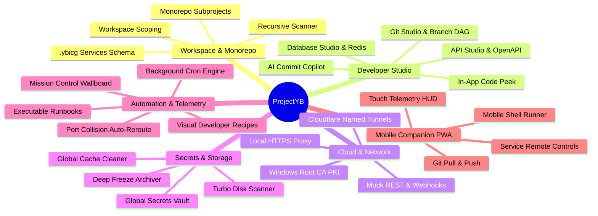

<div align="center">

# ProjectYB Desktop

### *Developer Command Center and Workspace Management Engine*

[](https://github.com/YbicG/ProjectYB/releases/tag/v1.1.0)
[](https://www.electronjs.org/)
[](https://react.dev/)
[](https://www.typescriptlang.org/)
[](https://tailwindcss.com/)
[](https://vitejs.dev/)
[](#getting-started)
[](LICENSE)

<br />

**ProjectYB** is a high-performance desktop workstation designed to eliminate context switching for software engineers. It unifies recursive project scanning, monorepo management, hardware-accelerated PTY terminals, embedded Git and GitHub studios, multi-engine database querying, Cloudflare Zero Trust tunneling, trusted local HTTPS proxying, encrypted secret vaults, executable Markdown runbooks, and a responsive mobile companion PWA into a single desktop application.

<br />

[Key Features](#key-features-showcase) •
[Architecture](#architecture--tech-stack) •
[Getting Started](#getting-started) •
[Shortcuts](#keyboard-shortcuts-cheat-sheet) •
[Documentation](#documentation-index)

</div>

---

## Value Proposition & Overview

Modern software engineering involves juggling dozens of disparate tools: terminal emulators, Git GUI clients, database inspectors, API testers, `.env` file editors, tunneling utilities, Docker dashboards, and scratchpads. 

**ProjectYB consolidates this entire developer toolchain into one unified, high-performance workstation:**

- **Zero Configuration Discovery**: Recursively detects projects across your filesystem (Node.js, Python, Go, Rust, Monorepos) with instant script and environment extraction.
- **Hardware-Accelerated Terminal Dock**: Omnipresent sliding PTY terminal dock (`Ctrl+` `) with WebGL acceleration that persists state across page transitions.
- **Zero Trust Cloudflare Tunnels & Local HTTPS**: 1-click public URL generation and local `.test` domain reverse proxying with trusted green padlocks via Windows Root CA.
- **Multi-Engine Database Studio**: Direct SQL querying and schema exploration for SQLite, PostgreSQL, MySQL, Redis, and MongoDB with automatic `.env` discovery and zero-dependency fallbacks.
- **Global Secrets Vault & Environment Sync**: Securely manage shared API keys, detect missing variables against `.env.example`, and sync credentials in 1 click.
- **Mobile Companion PWA**: Control background services, monitor hardware telemetry, run shell commands, and push Git commits directly from your smartphone over local WiFi or Cloudflare tunnels.

---

## Key Features Showcase



### 1. Workspace & Monorepo Hierarchy
* **Recursive Discovery**: Automatically scans root directories (e.g., `D:\Code`) detecting markers for Node.js, Python, Rust (Cargo), Go, and monorepos (`apps/`, `packages/`).
* **Subproject Action Toolbar**: 1-click terminal launch, folder explorer, code peek, `.env` manager, and VS Code integration for nested monorepo packages.
* **Workspace Scoping Engine**: Organize repositories into custom isolated workspaces (e.g., *Frontend*, *Microservices*, *Client A*) that scope the entire UI, Git views, and services.
* **Team-Shared Configuration**: Stores service scripts and multi-step run configurations in `.ybicg/services.json` inside each repository for version-controlled consistency.

### 2. Developer Studio
* **Git Studio & Branch DAG**: High-performance windowed working tree capable of handling 10,000+ file changes with zero lag, interactive branch tree visualization, 3-way merge conflict editor, and GitHub PR/issue tracking.
* **AI Commit Copilot**: Integrated support for local Ollama, Anthropic Claude, OpenAI, Google Gemini, and custom endpoints to generate conventional commit messages and diagnose runtime errors.
* **Database Studio**: Interactive SQL console with syntax helpers, schema inspector, table data grid with CSV/JSON export, and a dedicated Redis RESP key-value browser with live TTL tracking.
* **API Studio & OpenAPI Explorer**: Native REST client supporting custom headers, query params, response benchmarking, and automatic loading of OpenAPI/Swagger 2.0/3.0 specifications.
* **In-App Quick Code Peek**: Instant file inspector with line-number gutters, live dirty state indicators, clipboard copy, and `Ctrl+S` hotkey file saving directly to disk.

### 3. Cloud, Network & Security
* **Cloudflare Zero Trust Hub**: Manage Quick Tunnels (`trycloudflare.com`) and Cloudflare API v4 Named Tunnels with automated DNS CNAME routing and custom hostname provisioning.
* **Local HTTPS Reverse Proxy**: Built-in SNI proxy routing custom `.test` and `.local` domains to backend development ports with full WebSocket / Vite HMR support.
* **Windows Root CA PKI Engine**: Automated Root CA generation and Windows Certificate Store trust injection for native green-padlock HTTPS in Chrome, Edge, and Node.
* **Mock REST Server & Webhook Catcher**: Local HTTP server for creating mock endpoints, response payloads, latency simulations, and real-time webhook payload inspection.

### 4. Secrets, Environments & Disk Optimizer
* **Global Secrets Vault (AES-256)**: Secure local credential vault for storing shared API keys across AI providers, databases, and third-party services with 1-click sync to `.env`.
* **Environment Profiler & Compare**: Side-by-side diff tool for cross-environment comparisons, script benchmarking, and auto-generation of `.env.example` files.
* **Deep Freeze Project Archiver**: Scans dormant repositories (>14/30/60/90 days) and purges heavy build artifacts (`node_modules`, `dist`, `.turbo`) with 1-click restore (thaw).
* **Turbo Disk Space Analyzer**: Parallel directory scanner that breaks down disk usage by dependencies, build caches, and untracked artifacts.

### 5. Automation, Runbooks & Telemetry
* **Visual Developer Recipes**: Visual workflow builder executing chained commands, parallel script groups, conditional stops, and port wait gates.
* **Executable Markdown Runbooks**: Interactive Markdown editor supporting executable bash blocks (`▶ Dock` and `▶ Run`), clickable task checklists, and duration tracking.
* **Background Cron Engine**: Scheduled task runner executing jobs at configurable intervals or cron expressions with run history and execution telemetry.
* **Mission Control Telemetry Wallboard**: Live dashboard displaying system CPU/RAM sparklines, active port collisions, and cross-project Git commit feeds.
* **Smart Port Resolver**: Automatic port conflict detection with process PID inspection, process termination, and `.env` port rerouting.

### 6. Mobile Remote Companion PWA
* **Zero-Install Touch Interface**: Responsive progressive web application served on local port `4848` (or Cloudflare tunnel) with pure vector SVG graphics.
* **PIN Authentication**: Secure device pairing with QR code scanning and SHA-256 handshake verification.
* **Remote Controls**: Start and stop background services, run ad-hoc shell commands, trigger Git commit/push workflows, and execute emergency stops from any mobile device.

---

## Architecture & Tech Stack

ProjectYB is built on a multi-process architecture with strict process isolation and type-safe IPC communication:

```
┌────────────────────────────────────────────────────────────────────────┐
│                          REACT 19 RENDERER                             │
│  ┌──────────────────────────────────────────────────────────────────┐  │
│  │ Dual Layout: Modern Bento Dashboard & Classic Workspace Layout   │  │
│  │ 35 Zustand Domain Stores (Hydrated with electron-store)          │  │
│  │ WebGL Accelerated Universal Bottom Terminal Dock (@xterm/xterm)  │  │
│  └──────────────────────────────────────────────────────────────────┘  │
└────────────────────────────────────┬───────────────────────────────────┘
                                     │ contextBridge.exposeInMainWorld('api')
┌────────────────────────────────────▼───────────────────────────────────┐
│                       PRELOAD ISOLATION BRIDGE                         │
│  • 38 Strongly Typed API Namespaces (IElectronAPI)                     │
│  • Bidirectional IPC Handlers & Reactive Event Stream Listeners        │
└────────────────────────────────────┬───────────────────────────────────┘
                                     │ ipcRenderer.invoke / ipcMain.handle
┌────────────────────────────────────▼───────────────────────────────────┐
│                         ELECTRON MAIN PROCESS                          │
│  ┌─────────────────────────┐  ┌─────────────────────────────────────┐  │
│  │ Core Services (40)      │  │ Network Daemons                     │  │
│  │ • node-pty Process Pool │  │ • Local HTTPS Reverse Proxy (SNI)   │  │
│  │ • Multi-Tier SQLite     │  │ • Mobile Companion HTTP/SSE (4848)  │  │
│  │ • System Monitor & Disk │  │ • Mock REST Server & Webhooks       │  │
│  │ • Root CA PKI Generator │  │ • Cloudflared Tunnel Subprocess     │  │
│  └─────────────────────────┘  └─────────────────────────────────────┘  │
│  ┌──────────────────────────────────────────────────────────────────┐  │
│  │ Platform Integrations (PowerShell, Windows Cert Store, netstat)  │  │
│  └──────────────────────────────────────────────────────────────────┘  │
└────────────────────────────────────────────────────────────────────────┘
```

| Subsystem | Technology | Purpose |
| :--- | :--- | :--- |
| **Desktop Runtime** | Electron 34.2.0 | Multi-process desktop application container |
| **Build & Bundling** | Electron-Vite 3.0 + Vite 6.1 | Lightning-fast HMR and optimized production builds |
| **Frontend Framework** | React 19.0.0 + TypeScript 5.7 | Modern component architecture with strict typing |
| **State Management** | Zustand 5.0 | 35 decoupled domain stores with persistent hydration |
| **Styling & Design System** | Tailwind CSS v4 + Radix UI + Framer Motion | High-density OLED dark interface with dynamic accent tokens |
| **Terminal Subsystem** | `node-pty` 1.0 + `@xterm/xterm` 5.5 + WebGL Addon | Hardware-accelerated terminal emulation and PTY multiplexing |
| **Database Engine** | Native `node:sqlite` + `sqlite3` CLI + Net sockets | Multi-tier resilient SQL querying and Redis RESP protocol |
| **Network & SSL** | Node.js `https` / `tls` SNI + Windows CryptoAPI | Local HTTPS proxy and automated trusted certificate management |
| **Source Control** | `simple-git` 3.27 + `@octokit/rest` 21.1 | Native Git CLI execution and GitHub REST API v3 integration |
| **System Telemetry** | `systeminformation` 5.23 + Node OS/ChildProcess | Real-time CPU, RAM, disk, process tree, and socket inspection |

---

## Getting Started

### Prerequisites

Ensure you have the following installed on your workstation:
* **Node.js**: `v20.0.0` or higher (Node 22 LTS recommended)
* **Package Manager**: `pnpm` (recommended), `npm`, or `yarn`
* **Git**: `v2.30.0` or higher
* *(Optional)* **Docker Desktop**: For container dashboard and database probing
* *(Optional)* **Cloudflared**: For Cloudflare Zero Trust tunneling (can also be installed automatically within the app)

### Development Setup

1. **Clone the repository**:
   ```bash
   git clone https://github.com/YbicG/ProjectYB.git
   cd ProjectYB
   ```

2. **Install dependencies**:
   ```bash
   pnpm install
   ```

3. **Launch in development mode**:
   ```bash
   pnpm dev
   ```
   *Electron will launch with hot-module replacement (HMR) and Chrome DevTools enabled.*

### Type Checking & Linting

```bash
# Run TypeScript checks for both Main and Renderer processes
pnpm typecheck

# Run test suite
pnpm test

# Run ESLint across the codebase
pnpm lint
```

### Packaging & Distribution

Build production installers and executables:

```bash
# Build unpacked directory (Windows)
pnpm package:dir

# Build Windows x64 NSIS Installer
pnpm package:win

# Build macOS DMG
pnpm package:mac

# Build Linux AppImage / DEB
pnpm package:linux
```

---

## Keyboard Shortcuts Cheat Sheet

ProjectYB features an extensive keyboard navigation engine. Press `Ctrl+/` anywhere in the app to view the interactive cheat sheet.

| Shortcut | Action | Scope |
| :--- | :--- | :--- |
| <kbd>Ctrl</kbd> + <kbd>K</kbd> | Open Universal Command Palette | Global |
| <kbd>Ctrl</kbd> + <kbd>`</kbd> / <kbd>~</kbd> | Toggle Universal Bottom Terminal Dock | Global |
| <kbd>Ctrl</kbd> + <kbd>Shift</kbd> + <kbd>N</kbd> | Open Global Scratchpad | Global |
| <kbd>Ctrl</kbd> + <kbd>Shift</kbd> + <kbd>F</kbd> | Open Global Cross-Project Search | Global |
| <kbd>Ctrl</kbd> + <kbd>Shift</kbd> + <kbd>V</kbd> | Open Command Snippets Vault | Global |
| <kbd>Ctrl</kbd> + <kbd>Shift</kbd> + <kbd>M</kbd> | Open Mobile Remote Companion Pairing | Global |
| <kbd>Ctrl</kbd> + <kbd>/</kbd> | Open Keyboard Shortcuts Cheat Sheet | Global |
| <kbd>Ctrl</kbd> + <kbd>S</kbd> | Save file in Code Peek / Notes Editor | Editor Views |
| <kbd>Ctrl</kbd> + <kbd>B</kbd> | Toggle Sidebar Navigation Rail | Global |
| <kbd>Esc</kbd> | Close active modal / Unfocus search | Global |

---

## Documentation Index

For exhaustive technical guides, architecture deep dives, and API specifications, consult the comprehensive documentation in `docs/`:

* **[Architecture Guide (`docs/ARCHITECTURE.md`)](docs/ARCHITECTURE.md)**: Deep dive into the Main Process, Preload ContextBridge, React Renderer, Zustand stores, PTY terminal lifecycle, Multi-Tier SQLite engine, and Local HTTPS reverse proxy.
* **[Features Guide (`docs/FEATURES.md`)](docs/FEATURES.md)**: Exhaustive walkthrough of every capability across all 15 implementation phases.
* **[User Guide (`docs/USER_GUIDE.md`)](docs/USER_GUIDE.md)**: Step-by-step practical developer workflows, recipes, monorepo management, and Mobile PWA pairing.
* **[IPC Reference (`docs/IPC_REFERENCE.md`)](docs/IPC_REFERENCE.md)**: Complete specification of all 39 IPC modules, 60+ channels, request payloads, response schemas, and streaming events.

---

## Contributing

Contributions, issues, and feature requests are welcome:

1. Fork the repository
2. Create your feature branch (`git checkout -b feature/amazing-feature`)
3. Commit your changes (`git commit -m 'feat: add amazing feature'`)
4. Push to the branch (`git push origin feature/amazing-feature`)
5. Open a Pull Request

---

## License

Distributed under the **MIT License**. See `LICENSE` for more information.

---

<div align="center">
  <sub>Built with ❤️ by <b>YBicG</b> and the ProjectYB Engineering Team.</sub>
</div>

