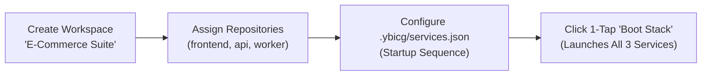
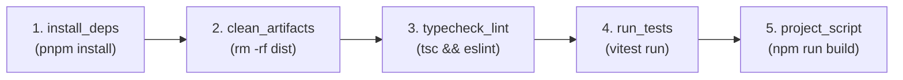

# 📚 ProjectYB Practical User Guide & Workflows

A practical, step-by-step operational guide for developers using **ProjectYB Desktop & Mobile Companion**.

---

## 📑 Table of Contents

1. [Initial Setup & Workspace Configuration](#1-initial-setup--workspace-configuration)
2. [Workflow: Managing Workspaces & Multi-Service Stacks](#2-workflow-managing-workspaces--multi-service-stacks)
3. [Workflow: Running Services & Resolving Port Conflicts](#3-workflow-running-services--resolving-port-conflicts)
4. [Workflow: Navigating Monorepos & Nested Subprojects](#4-workflow-navigating-monorepos--nested-subprojects)
5. [Workflow: Git Operations & AI Commit Messages](#5-workflow-git-operations--ai-commit-messages)
6. [Workflow: Resolving 3-Way Git Merge Conflicts](#6-workflow-resolving-3-way-git-merge-conflicts)
7. [Workflow: Querying Databases & Browsing Redis Keys](#7-workflow-querying-databases--browsing-redis-keys)
8. [Workflow: Creating Cloudflare Tunnels & Local HTTPS Proxies](#8-workflow-creating-cloudflare-tunnels--local-https-proxies)
9. [Workflow: Managing Secrets & Syncing Environment Files](#9-workflow-managing-secrets--syncing-environment-files)
10. [Workflow: Authoring Executable Markdown Runbooks](#10-workflow-authoring-executable-markdown-runbooks)
11. [Workflow: Building Visual Developer Recipes](#11-workflow-building-visual-developer-recipes)
12. [Workflow: Deep-Freezing Inactive Repositories](#12-workflow-deep-freezing-inactive-repositories)
13. [Workflow: Generating Favicon & Web App Icon Suites](#13-workflow-generating-favicon--web-app-icon-suites)
14. [Workflow: Pairing & Controlling via Mobile Companion PWA](#14-workflow-pairing--controlling-via-mobile-companion-pwa)

---

## 1. Initial Setup & Workspace Configuration

### Step 1: Configure Root Scan Directories
1. Launch ProjectYB.
2. Navigate to **Settings** (`Ctrl+,` or click the gear icon on the sidebar).
3. Under **Project Scanner Settings**, add your code root directories (e.g. `D:\Code`, `C:\Users\username\Projects`).
4. Select your preferred scan mode:
   * **Marker Mode (Default)**: Automatically detects projects containing markers (`package.json`, `Cargo.toml`, `go.mod`, `requirements.txt`, `.git`).
   * **All Subfolders**: Imports all direct depth-1 subdirectories as projects.
5. Click **Scan Projects Now**. ProjectYB will recursively index all repositories in milliseconds.

### Step 2: Choose Your UI Layout
In **Settings > Appearance**, choose your preferred layout style:
* **Modern Bento Layout**: Bento cards, telemetry sparklines, collapsible icon rail, and omnipresent bottom terminal dock (`Ctrl+~`).
* **Classic Layout**: Traditional full-width dashboard with persistent left navigation.

---

## 2. Workflow: Managing Workspaces & Multi-Service Stacks

Isolate your daily work by grouping repositories into dedicated workspaces (e.g. *Client Portal*, *Core Backend*, *Microservices*).



### Steps:
1. Click the **Workspace Selector** chip in the top command header.
2. Click **+ New Workspace**, name it (e.g. `E-Commerce Suite`), and choose an icon/color.
3. Check the repositories you want to include in this workspace.
4. Click **Save Workspace**.
5. Once selected, the entire application—Dashboard, Git Studio, Database Studio, Services, and Command Palette—will filter strictly to the assigned repositories.
6. Click the **Boot Stack** button (`<Play />`) next to the workspace selector to launch all background services declared in the stack simultaneously.

---

## 3. Workflow: Running Services & Resolving Port Conflicts

When launching a development server (e.g. `npm run dev`), port collisions with zombie processes or other apps can occur.

### Starting a Service:
1. On the project card or Workbench, locate the **Scripts** section.
2. Click **`▶ dev`** or any custom script.
3. The service starts in the background and is assigned a real-time status badge and live CPU/RAM monitoring.

### Handling Port Collisions:
If the required port (e.g. port `3000`) is occupied:
1. ProjectYB intercepts the port conflict and displays the **Port Collision Dialog**.
2. The dialog identifies the exact Windows PID and process name holding the port (e.g. `node.exe - PID: 18492`).
3. Select one of two resolution paths:
   * **"Kill Colliding Process"**: Forcefully terminates the occupying process using `taskkill /F /PID` and frees port `3000` immediately.
   * **"Auto-Reroute to Next Free Port"**: Automatically locates the next free TCP port (e.g. `3001`), updates the project's `.env` (`PORT=3001`), and launches the service.

---

## 4. Workflow: Navigating Monorepos & Nested Subprojects

Monorepo architectures (`turborepo`, `nx`, `pnpm-workspaces`) have subprojects nested inside `apps/` and `packages/`.

### Steps:
1. Open the project in the **Project Workbench**.
2. Click on the **Subprojects & Code** tab.
3. ProjectYB lists every nested package with its detected type, scripts, and path.
4. Use the **Subproject Action Toolbar**:
   * Click **`>_ Terminal`** to launch a dedicated PTY terminal in the Universal Bottom Dock (`Ctrl+~`) scoped directly to `apps/web`.
   * Click **`⚡ Code Peek`** to quickly view or edit `package.json` or `tsconfig.json` without opening an external IDE.
   * Click **`🔒 Subproject .env`** to manage environment variables specific to that package.

---

## 5. Workflow: Git Operations & AI Commit Messages

Commit changes with clean conventional commit messages generated by AI based on staged diffs.

```
┌────────────────────────────────────────────────────────────────────────┐
│ 📝 GIT STUDIO                                                          │
├────────────────────────────────────────────────────────────────────────┤
│ 1. Review Working Tree (10,000+ files handled smoothly via virtualization)
│ 2. Click [+] to Stage specific files or [Stage All]                    │
│ 3. Click [AI Generate Message ✨]                                      │
│    -> Copilot analyzes git diff --staged                               │
│    -> Generates: "feat(auth): implement JWT refresh token rotation"     │
│ 4. Press [Ctrl + Enter] to Commit & Push to Remote                     │
└────────────────────────────────────────────────────────────────────────┘
```

### Steps:
1. Open **Git Studio** (`Ctrl+G` or click **Git** in the sidebar).
2. Review modified files in the working tree. Filter by filename using the instant search input.
3. Click the **`+`** icon next to a file to stage it, or click **Stage All**.
4. In the commit panel, select your AI model style (**Conventional**, **Short**, or **Detailed**).
5. Click **AI Generate Message ✨**. ProjectYB queries your configured AI provider (Ollama, Claude, OpenAI, Gemini) and formats a message based on the diff.
6. Press <kbd>Ctrl</kbd> + <kbd>Enter</kbd> to commit and push upstream.

---

## 6. Workflow: Resolving 3-Way Git Merge Conflicts

When a `git pull` or `git merge` results in conflicts:

### Steps:
1. Git Studio flags conflicted files with a red **Conflict** badge.
2. Click **Resolve Conflicts** to open the **Visual 3-Way Merge Conflict Editor**.
3. The editor parses the conflict blocks:
   * **Current Change (`<<<<<<< HEAD`)**
   * **Incoming Change (`>>>>>>> branch`)**
4. Click **Accept Current**, **Accept Incoming**, or **Accept Both** for each block.
5. Review the preview diff.
6. Click **Save & Mark Resolved**. ProjectYB stages the resolved file automatically.

---

## 7. Workflow: Querying Databases & Browsing Redis Keys

Query databases and explore schemas without installing external tools like DBeaver or TablePlus.

### Steps:
1. Navigate to **Database Studio** in the sidebar.
2. ProjectYB auto-discovers database connection strings from all project `.env` files.
3. **SQLite**:
   * Click on any `.sqlite` or `.db` file in the sidebar.
   * Browse tables in the **Schema Tree**. Click on any table to view column types and primary keys.
   * Click **Inspect Rows** to execute `SELECT * FROM <table> LIMIT 50;`.
   * Type custom SQL queries in the console and click **▶ Run Query**.
   * Export results to CSV or JSON with 1 click.
4. **Redis**:
   * Connect to a local Redis instance (e.g. `redis://localhost:6379`).
   * Browse keys by pattern (`user:*`, `cache:*`, `*`).
   * Inspect key TTL timers and inspect JSON or raw string values.

---

## 8. Workflow: Creating Cloudflare Tunnels & Local HTTPS Proxies

### Option A: 1-Click Quick Tunnel (Public Internet)
1. Go to **Network > Cloudflare Tunnels**.
2. Click **Create Quick Tunnel**.
3. Enter the local port (e.g. `3000`) and click **Launch Tunnel**.
4. A public URL (e.g. `https://random-words.trycloudflare.com`) is generated immediately. Share this URL for webhooks, client demos, or mobile testing.

### Option B: Local HTTPS Proxy with Green Padlock (`.test` Domain)
1. Go to **Network > Local HTTPS Proxy**.
2. If first time, click **Install Root CA**. Windows will trust the ProjectYB Local Root Certificate Authority.
3. Click **Add Proxy Route**:
   * **Domain**: `api.my-app.test`
   * **Target Port**: `8080`
   * **Enable HTTPS**: Checked
4. Click **Sync Hosts File**. ProjectYB maps `api.my-app.test` to `127.0.0.1` in the Windows `hosts` file.
5. Open `https://api.my-app.test` in Chrome/Edge/Safari. You will see a trusted green padlock.

---

## 9. Workflow: Managing Secrets & Syncing Environment Files

Manage shared API keys in an encrypted central vault and sync them to `.env` files.

### Steps:
1. Open the **Global Secrets Vault** modal (<kbd>Ctrl</kbd>+<kbd>K</kbd> -> "Open Secrets Vault").
2. Click **+ Add Secret** (e.g. `OPENAI_API_KEY`, `STRIPE_SECRET_KEY`, `DATABASE_URL`).
3. Assign categories (`AI`, `Payments`, `Database`) and environment tags (`Dev`, `Prod`).
4. To sync secrets into a project:
   * Open the project's **Environment Manager**.
   * Click **Sync from Vault**. ProjectYB automatically populates empty variables matching vault keys.
   * Click **Profile .env** to verify that all required keys declared in `.env.example` are present.

---

## 10. Workflow: Authoring Executable Markdown Runbooks

Transform static markdown documentation into interactive executable runbooks.

### Steps:
1. Open the **Notes** tab in the Project Workbench.
2. Write documentation in Markdown. Include executable code blocks with language tags:
   ````markdown
   # Database Reset Runbook
   To purge and reseed the database:

   ```bash
   pnpm prisma migrate reset --force
   ```
   ````
3. In the live preview, the code block renders with interactive buttons:
   * Click **`▶ Run in Dock`** to execute the command inside the Universal Bottom Dock.
   * Click **`▶ Execute Command`** to run inline and capture the output, duration, and exit code directly beneath the note.

---

## 11. Workflow: Building Visual Developer Recipes

Automate multi-step development pipelines with visual action blocks.



### Steps:
1. Navigate to **Developer Recipes** in the sidebar.
2. Click **+ New Recipe** (e.g. `Full CI Verification`).
3. Drag or add action blocks from the **Action Palette**:
   * `install_deps` -> `clean_artifacts` -> `typecheck_lint` -> `run_tests` -> `project_script (build)`.
4. Set execution parameters and toggle **Stop on Failure**.
5. Click **▶ Run Recipe**. Monitor the live progress indicators, step duration timers, and unified log stream.

---

## 12. Workflow: Deep-Freezing Inactive Repositories

Reclaim tens of gigabytes of disk space occupied by stale `node_modules` folders.

### Steps:
1. Open the **Disk Optimizer & Deep Freeze Archiver** modal.
2. Set the inactivity threshold (e.g. **Dormant > 30 Days**).
3. ProjectYB analyzes dormant repositories and displays total reclaimable bytes (e.g. `48.2 GB`).
4. Click **Deep Freeze All Inactive**.
5. The build artifacts (`node_modules`, `.cache`, `target`, `dist`) are safely purged while preserving all source files and saving a compressed manifest.
6. When returning to a frozen project, click **1-Click Thaw** on the project card to reinstall dependencies.

---

## 13. Workflow: Generating Favicon & Web App Icon Suites

Generate all required responsive favicons and PWA web app icons from a single source image.

### Steps:
1. Open the project in the Workbench.
2. Click the **Asset Forge** button on the header HUD.
3. Drag and drop your source logo (PNG, SVG, or high-res JPG).
4. Click **Generate Favicon Suite**.
5. ProjectYB uses Electron's native image engine to generate:
   * `favicon.ico`
   * `favicon-16x16.png`
   * `favicon-32x32.png`
   * `apple-touch-icon.png` (180x180)
   * `android-chrome-192x192.png`
   * `android-chrome-512x512.png`
   * `site.webmanifest`
   Directly into your project's `public/` directory.

---

## 14. Workflow: Pairing & Controlling via Mobile Companion PWA

Control desktop background services, monitor hardware telemetry, run shell commands, and push Git commits from your smartphone.

```
┌────────────────────────────────────────────────────────────────────────┐
│ 📱 PAIR MOBILE COMPANION                                               │
├────────────────────────────────────────────────────────────────────────┤
│ 1. Open [Mobile Remote] from the top header HUD.                       │
│ 2. Click [Start Mobile Server] (Running on port 4848).                 │
│ 3. Scan the generated QR Code with your iPhone / Android camera.       │
│ 4. Enter Desktop Credentials (Username: admin | Password: ••••••••)   │
│ 5. Tap [Add to Home Screen] in Safari/Chrome to install the PWA.       │
└────────────────────────────────────────────────────────────────────────┘
```

### Mobile Operations:
* **HUD Tab**: View live desktop CPU and RAM utilization gauges.
* **Services Tab**: View running background services; start, stop, restart, or view live streaming stdout logs.
* **Console Tab**: Run shell commands directly in any project folder with quick preset buttons (`git status`, `git pull`, `npm test`, `docker ps`).
* **Git Tab**: Check working tree status, trigger `git pull`, and stage/commit/push changes.
* **Tasks Tab**: Trigger scheduled cron jobs on demand.
* **Notes Tab**: Write notes on your phone that synchronize directly with the desktop Global Scratchpad.
* **1-Tap STOP**: Tap the red emergency **STOP** button to immediately terminate all active desktop background processes.

---

<div align="center">
  <sub>ProjectYB User Guide • Version 1.0.0 • Maintained by YBicG</sub>
</div>
