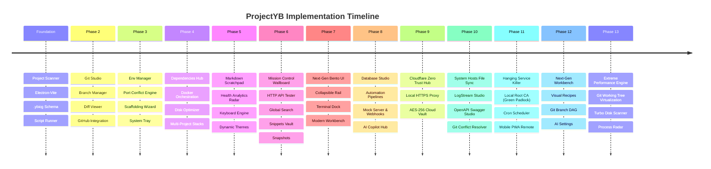

# ProjectYB — Development Timeline & Implementation Phases

A comprehensive chronological record of all architectural milestones, backend services, IPC layers, UI design systems, and developer toolkits implemented across **ProjectYB Desktop & Mobile Companion**.

---

---

## Foundation: Core Project Architecture & Scanning Engine

The core framework and runtime foundation establishing the Electron-Vite desktop platform.

### Key Capabilities
- **Recursive Project Scanner**: Automatically scans configured root directories (e.g. `D:\Code`) for development projects by detecting markers such as `package.json`, `requirements.txt`, `Cargo.toml`, `go.mod`, `.git`, and monorepo folders (`apps/`, `packages/`).
- **Scan Modes**: Supports both marker-based project discovery and **"All Subfolders"** depth-1 import mode, plus direct manual project additions.
- **Monorepo & Subproject Hierarchy**: Recursive detection of nested projects inside monorepo workspaces with dedicated subproject cards and execution contexts.
- **Project Configuration (`.ybicg`)**: Per-project metadata storage located in `.ybicg/services.json` and `.ybicg/project.json` for custom scripts, categories, tags, environment variables, and execution parameters.
- **Interactive PTY Terminal Engine**: Built on `node-pty` and `@xterm/xterm` with WebGL hardware acceleration, Canvas fallback, dynamic resize debouncing (`FitAddon`), and tab/grid layout management.

### Key Files & IPC
- **Backend Services**: `src/main/services/project-scanner.ts`, `src/main/services/terminal.service.ts`
- **IPC Channels**: `projects:scan`, `projects:getDetails`, `projects:addManual`, `terminal:create`, `terminal:write`, `terminal:resize`, `terminal:kill`
- **Stores & UI**: `useProjectStore.ts`, `useTerminalStore.ts`, `ProjectGrid.tsx`, `ProjectDetailPage.tsx`

---

## Phase 2: Git & GitHub Integration Hub

An embedded source control studio offering complete version control workflows without leaving the application.

### Key Capabilities
- **Real-Time Git Status**: Visual distinction between staged, unstaged, and untracked files with file discard and staging controls.
- **Commit Studio & AI Message Generator**: Rich commit authoring with branch name tracking, commit amendments, and 1-click AI-generated conventional commit messages.
- **Visual Diff Viewer**: Interactive unified and side-by-side diffing powered by `@monaco-editor/react` with syntax highlighting and chunk navigation.
- **Branch & Remote Manager**: Searchable branch selector, checkout, branch creation, fast-forward pulls, push with upstream tracking, and stash manager (apply/drop/pop).
- **GitHub Panel**: Live GitHub API v3 integration pulling repository metadata, stars, open Pull Requests, Issues, and release statuses.

### Key Files & IPC
- **Backend Services**: `src/main/services/git.service.ts`, `src/main/services/github.service.ts`
- **IPC Channels**: `git:status`, `git:diff`, `git:commit`, `git:push`, `git:pull`, `git:branches`, `git:checkout`, `git:stash`, `github:getRepoInfo`, `github:getPullRequests`, `github:getIssues`
- **Stores & UI**: `useGitStore.ts`, `GitPage.tsx`, `GitStatus.tsx`, `GitCommit.tsx`, `GitDiff.tsx`, `GitBranches.tsx`, `GitHubPanel.tsx`

---

## Phase 3: Environment Manager, Port Guardian & Scaffolding Wizard

Developer workflow utilities for configuration management, network port conflict prevention, and rapid project initiation.

### Key Capabilities
- **Environment Variable Manager**: Multi-environment file inspector (`.env`, `.env.local`, `.env.production`, `.env.example`) with key-value grid editing, secret masking/revealing, and visual side-by-side diff comparison between environments.
- **Port Manager & Conflict Prevention**: High-performance port listener scanner detecting open TCP ports, mapped PIDs, process names, and offering 1-click termination to free blocked development ports.
- **Project Template & Scaffolding Wizard**: Automated project generator for Next.js, Vite React/Vue, FastAPI, Express, Rust (Cargo), and Go with package manager selection (`npm`, `pnpm`, `yarn`, `bun`) and instant Git repository initialization.
- **System Tray & Background Daemon**: Minimize-to-tray and close-to-tray lifecycle management with context tray menu (`Show App`, `Active Services Count`, `Quit`), preserving long-running dev servers.

### Key Files & IPC
- **Backend Services**: `src/main/services/env.service.ts`, `src/main/services/port.service.ts`, `src/main/services/template.service.ts`, `src/main/services/tray.service.ts`
- **IPC Channels**: `env:listFiles`, `env:readFile`, `env:writeFile`, `ports:list`, `ports:kill`, `templates:list`, `templates:scaffold`
- **Stores & UI**: `useEnvStore.ts`, `usePortStore.ts`, `useTemplateStore.ts`, `EnvManagerDialog.tsx`, `PortManager.tsx`, `CreateProjectDialog.tsx`

---

## Phase 4: Dependencies Hub, Docker Orchestration, Disk Optimizer & Multi-Project Stacks

Infrastructure, container management, dependency security auditing, and disk storage reclamation.

### Key Capabilities
- **Dependency & Vulnerability Hub**: Scans installed dependencies across Node, Python, Rust, and Go ecosystems; detects outdated packages with 1-click batch upgrades (`npm outdated`, `pip list --outdated`); runs automated security vulnerability audits (`npm audit`).
- **Docker & Container Orchestrator**: Real-time Docker daemon health detection, container lifecycle management (start, stop, restart, remove), streaming container logs with search/filter, and database connection probing (PostgreSQL, MySQL, Redis, MongoDB).
- **Disk Space Optimizer & Cache Cleaner**: Deep recursive disk scanner identifying heavy build artifacts (`node_modules`, `target`, `dist`, `.cache`, `.venv`, `.next`); global cache cleaner for package manager caches (`npm cache clean`, `pip cache purge`, Docker build cache).
- **Multi-Project Workspaces & Stacks**: Multi-repository grouping engine allowing developers to configure and boot multi-service stacks (e.g. Frontend + Backend API + Microservice + Database) in sequence or parallel.

### Key Files & IPC
- **Backend Services**: `src/main/services/dependency.service.ts`, `src/main/services/docker.service.ts`, `src/main/services/disk-cleaner.service.ts`, `src/main/services/workspace.service.ts`
- **IPC Channels**: `dependencies:getInstalled`, `dependencies:getOutdated`, `dependencies:install`, `dependencies:audit`, `docker:getStatus`, `docker:listContainers`, `docker:containerAction`, `docker:getLogs`, `disk:analyzeProjects`, `disk:cleanArtifacts`, `disk:cleanGlobalCaches`
- **Stores & UI**: `useDependencyStore.ts`, `useDockerStore.ts`, `useDiskStore.ts`, `useWorkspaceStore.ts`, `DependenciesPage.tsx`, `DockerDashboard.tsx`, `OptimizerPage.tsx`

---

## Phase 5: Project Notes, Health Analytics Radar, Keyboard Engine & Themes

Knowledge management, cross-project health telemetry, ergonomic keyboard navigation, and deep visual personalization.

### Key Capabilities
- **In-App Project Notes & Global Scratchpad**: Per-project markdown editor with split-pane live preview; omnipresent Global Scratchpad modal (`Ctrl+Shift+N`) with debounced auto-save for cross-project todos and quick snippets.
- **Cross-Project Health Analytics Radar**: Aggregated developer radar calculating project activity score, git commit frequency, uncommitted changes, open branches, dependency health index, and disk footprint.
- **Keyboard Navigation Engine**: Global hotkey system featuring universal Command Palette (`Ctrl+K`), terminal dock toggle (`Ctrl+` `), search shortcuts (`Ctrl+Shift+F`), scratchpad (`Ctrl+Shift+N`), and shortcuts cheat sheet modal (`?` or `Ctrl+/`).
- **Dynamic Theme & Accent Engine**: OLED Dark mode baseline with live accent color switching (Violet, Cyber Emerald, Solar Amber, Neon Cyan, Sunset Rose), configurable terminal font sizes, line heights, and cursor styles.
- **Project Pinning & Favorites**: Quick-access favorite project pinning with dedicated top-tier dashboard shelf.

### Key Files & IPC
- **Backend Services**: `src/main/services/notes.service.ts`, `src/main/services/health.service.ts`
- **IPC Channels**: `notes:read`, `notes:write`, `notes:getGlobalScratchpad`, `notes:setGlobalScratchpad`, `health:getOverview`, `health:getProjectAnalytics`
- **Stores & UI**: `useNotesStore.ts`, `useHealthStore.ts`, `useThemeStore.ts`, `useKeyboard.ts`, `MarkdownNotesEditor.tsx`, `GlobalScratchpadModal.tsx`, `HealthAnalyticsModal.tsx`

---

## Phase 6: Mission Control Wallboard, In-App HTTP API Tester, Global Search & Clean Snapshots

Real-time developer telemetry, API testing, cross-repository search, command vaults, and source code archiving.

### Key Capabilities
- **Mission Control Wallboard**: Live wallboard dashboard with streaming CPU/Memory sparkline charts, active background services grid, real-time Git commit activity log feed, and Docker container radar.
- **In-App HTTP API Tester**: Native REST client supporting standard HTTP methods (GET, POST, PUT, PATCH, DELETE), dynamic query parameter builders, customizable headers with autocomplete, JSON request body editor, response time benchmarking, status badges, and formatted response inspector.
- **Global Cross-Project Search**: High-speed text and regular expression search across all scanned repositories with live file previews, match line indicators, and 1-click file opening.
- **Command Snippets Vault**: Centralized snippet bank for saving reusable shell scripts, database queries, and deployment commands with tag categorization, copy-to-clipboard, and direct terminal execution.
- **Clean Project Snapshots**: Source archive creator generating clean `.zip` backups automatically excluding build artifacts (`node_modules`, `dist`, `.git`, `.turbo`) for lightweight sharing and archiving.

### Key Files & IPC
- **Backend Services**: `src/main/services/search.service.ts`, `src/main/services/http-client.service.ts`, `src/main/services/archive.service.ts`
- **IPC Channels**: `search:query`, `http:sendRequest`, `archive:createSnapshot`
- **Stores & UI**: `useOverviewStore.ts`, `useHttpStore.ts`, `useSearchStore.ts`, `useSnippetStore.ts`, `OverviewPage.tsx`, `ApiTesterPage.tsx`, `GlobalSearchModal.tsx`, `SnippetVaultModal.tsx`, `ProjectSnapshotDialog.tsx`

---

## Phase 7: Next-Gen Modern Bento UI/UX Overhaul

A comprehensive UI redesign providing an ultra-modern developer interface with Bento grids and persistent bottom docking.

### Key Capabilities
- **Dual-Layout Feature Flag**: Hot-swappable UI modes in Settings (**"Classic"** vs **"Modern Bento"**) without restarting the app or interrupting active terminals or background services.
- **Modern Bento Dashboard**: High-density bento grid cards, category pills, pinned project hubs, 1-tap quick scripts, and glassmorphic telemetry cards.
- **Collapsible Activity Rail**: Left navigation with expanded mode (workspace switchers, active service counters) and collapsed icon rail with rich tooltips.
- **Omnipresent Top Command Bar**: Breadcrumbs with interactive workspace scoping chips, quick command palette launcher (`Ctrl+K`), live telemetry spark gauges, and quick utility buttons.
- **Universal Bottom Terminal Dock (`Ctrl+` `)**: Dockable sliding terminal canvas available across ANY page without losing page state or terminal output, featuring height drag-resizing and WebGL acceleration.

### Key Files & Architecture
- **Layout Architecture**: `ModernAppLayout.tsx`, `ModernSidebar.tsx`, `ModernHeader.tsx`, `ModernTerminalDock.tsx`
- **Modern Pages**: `ModernBentoDashboard.tsx`, `ModernProjectWorkbench.tsx`
- **Design Tokens**: OLED black (`#09090b`), translucent borders (`border-zinc-800/80`), dynamic CSS accent variables, Plus Jakarta Sans & JetBrains Mono typography.

---

## Phase 8: Database Studio, Automation Pipelines, Mock REST Server & AI Copilot Hub

Advanced database querying, multi-step CI/CD automation, mock API emulation, and AI-assisted debugging.

### Key Capabilities
- **Database Studio**: Interactive query console and schema inspector supporting SQLite, PostgreSQL, MySQL, and Redis with tabular data grids, key-value browser, and execution time benchmarks.
- **Workflow & Automation Pipelines**: Multi-step sequential and DAG pipeline builder (`npm install` -> `test` -> `build` -> `dockerize`) with real-time step execution status, duration benchmarks, and stop-on-failure controls.
- **Mock REST Server & Webhook Catcher**: In-app HTTP mock server supporting custom routes, HTTP status codes, dynamic JSON response payloads, and configurable latency delays; incoming webhook payload inspector.
- **AI Diagnostics & Copilot Hub**: Integrated OpenAI & Anthropic Claude APIs for automated terminal error log analysis, 1-click Git commit message authoring, and project architecture explanation.

### Key Files & IPC
- **Backend Services**: `src/main/services/database.service.ts`, `src/main/services/pipeline.service.ts`, `src/main/services/mock-server.service.ts`, `src/main/services/ai.service.ts`
- **IPC Channels**: `database:connect`, `database:query`, `database:getTables`, `pipelines:execute`, `mock:startServer`, `mock:stopServer`, `mock:getRequests`, `ai:diagnoseError`, `ai:generateCommitMessage`
- **Stores & UI**: `useDatabaseStore.ts`, `usePipelineStore.ts`, `useMockServerStore.ts`, `useAiStore.ts`, `DatabasePage.tsx`, `PipelinesPage.tsx`, `MockServerPage.tsx`, `AiHubPage.tsx`

---

## Phase 9: Cloudflare Zero Trust Hub, Local HTTPS Reverse Proxy & Encrypted Cloud Vault

Public internet tunneling, local domain SSL proxying, and encrypted cloud synchronization.

### Key Capabilities
- **Cloudflare Zero Trust API Hub**: Cloudflare API v4 integration allowing developers to authenticate with API tokens, select Cloudflare Accounts/Zones, and create/manage 1-click Named Tunnels with automated DNS CNAME routing and public hostname mapping.
- **Local HTTPS Reverse Proxy Engine**: Built-in Node.js HTTPS reverse proxy mapping custom `.test` domains (e.g. `https://my-service.test`) to local development ports with SNI routing and custom SSL certificate generation.
- **Encrypted Cloud Vault & Sync**: Client-side AES-256-GCM encryption for backing up ProjectYB settings, workspaces, run configs, and snippets to Cloudflare KV or remote cloud endpoints with encryption passphrase protection.

### Key Files & IPC
- **Backend Services**: `src/main/services/cloudflare-api.service.ts`, `src/main/services/local-proxy.service.ts`, `src/main/services/cloud-sync.service.ts`
- **IPC Channels**: `cloudflare:validateToken`, `cloudflare:listTunnels`, `cloudflare:createNamedTunnel`, `proxy:start`, `proxy:stop`, `proxy:addRule`, `proxy:getRules`, `sync:exportVault`, `sync:importVault`
- **Stores & UI**: `useCloudflareStore.ts`, `useProxyStore.ts`, `useSyncStore.ts`, `LocalProxyPage.tsx`, `CreateTunnelDialog.tsx`, `CloudSyncSettings.tsx`

---

## Phase 10: System Hosts File Sync, LogStream Studio, OpenAPI Studio & Git Conflict Resolver

Operating system DNS resolution, multi-process log streaming, OpenAPI interactive documentation, and visual merge conflict resolution.

### Key Capabilities
- **System Hosts File Sync**: Windows `hosts` file DNS manager automatically syncing `.test` proxy domains to `127.0.0.1` using PowerShell administrative elevation.
- **Multi-Process LogStream Studio**: Unified log streaming aggregator capturing real-time stdout/stderr from active terminals, background services, and cron jobs; strips ANSI ConPTY escape noise, classifies log levels (INFO, WARN, ERROR), and provides regex filtering and log export.
- **OpenAPI / Swagger Studio**: Interactive API documentation explorer that parses local or remote OpenAPI 3.0 / Swagger 2.0 specs (`openapi.json`, `openapi.yaml`) with endpoint schema exploration and live test execution.
- **Visual Git Conflict Resolver**: 3-way merge conflict editor parsing conflict markers (`<<<<<<<`, `=======`, `>>>>>>>`) with 1-click **"Accept Current"**, **"Accept Incoming"**, or **"Accept Both"** resolution and diff preview.

### Key Files & IPC
- **Backend Services**: `src/main/services/hosts.service.ts`, `src/main/services/logstream.service.ts`, `src/main/services/openapi.service.ts`, `src/main/services/git-conflict.service.ts`
- **IPC Channels**: `hosts:read`, `hosts:syncRules`, `logstream:getLogs`, `openapi:parseSpec`, `openapi:testEndpoint`, `gitConflict:getConflicts`, `gitConflict:resolveConflict`
- **Stores & UI**: `useLogStreamStore.ts`, `useOpenApiStore.ts`, `LogStreamPage.tsx`, `OpenApiPage.tsx`, `GitConflictResolverModal.tsx`

---

## Phase 11: Hanging Service Killer, Local Root CA (Green Padlock), Background Cron Scheduler & Mobile Remote PWA

Process termination resilience, trusted local SSL, automated task scheduling, and smartphone developer companion.

### Key Capabilities
- **Hanging Service Detection & Force-Kill**: Process tree scanner using `taskkill /F /T` and socket checks to forcefully terminate zombie processes, stuck Node/Python daemons, and orphaned ports.
- **Local Root CA & Trusted SSL (Green Padlock Engine)**: Automated PowerShell PKI certificate generator and Windows Certificate Store installer (`Cert:\LocalMachine\Root`) producing valid SSL certificates for `.test` domains with trusted green padlocks in Chrome, Edge, and Safari.
- **Background Cron & Task Scheduler**: Cron job scheduling engine (`cron-parser` based) supporting cron expressions (e.g. `*/15 * * * *`), manual run execution, duration benchmarks, and enable/disable toggles.
- **Mobile Remote Companion PWA**: Complete touch-optimized Progressive Web App allowing developers to control desktop services from iOS/Android over local WiFi or Cloudflare Tunnels; includes real-time telemetry gauges, running service controls (logs, restart, stop, kill), 1-tap script runner, interactive shell runner, Git pull/commit/push, active port inspector, and desktop scratchpad synchronization.

### Key Files & IPC
- **Backend Services**: `src/main/services/service-killer.service.ts`, `src/main/services/root-ca.service.ts`, `src/main/services/cron.service.ts`, `src/main/services/mobile-companion.service.ts`
- **IPC Channels**: `serviceKiller:forceKill`, `rootCa:createAndInstallRootCa`, `rootCa:getRootCaStatus`, `cron:listJobs`, `cron:createJob`, `cron:executeJob`, `mobile:getStatus`, `mobile:startServer`, `mobile:stopServer`
- **Stores & UI**: `useMobileStore.ts`, `useCronStore.ts`, `MobileRemoteModal.tsx`, `CronPage.tsx`

---

## Refinements & Architecture Upgrades: Workspace Isolation & Vector SVG PWA

Recent architectural refinements elevating workspace isolation and mobile companion uniformity.

### Key Capabilities
- **Universal Workspace Project Scoping (`useWorkspaceProjects`)**:
  - Central reactive hook scoping the entire application across all views (Classic Dashboard, Modern Bento Dashboard, Top Breadcrumbs, Project Workbench, Git Studio, Services Page, Saved Configs, Command Palette, Health Overview, and Wallboard activity feed) strictly to the projects assigned to the active workspace.
  - 1-click reset to **"All Projects"** and dedicated empty workspace states with direct project assignment triggers.
- **Per-Project Service Configuration (`.ybicg/services.json`)**:
  - Services, multi-step run configs, and scripts are stored directly in `.ybicg/services.json` inside each repository for Git team portability.
- **100% Vector SVG Mobile Companion PWA**:
  - Completely eliminated all emoji glyphs in favor of sharp, lightweight inline Lucide-style vector SVG icons.
  - Implemented dynamic viewport safe-area insets (`env(safe-area-inset-top)` & `env(safe-area-inset-bottom)`) for seamless display on iPhone notches, Dynamic Islands, and Android navigation bars.
  - Synchronized real-time desktop background terminal processes and services with mobile PWA HUD.

---

## Architectural Summary Matrix

| Phase / Feature | Backend Services | IPC Channels | Key Renderer Stores | Primary Pages & Modals |
| :--- | :--- | :--- | :--- | :--- |
| **Foundation** | `project-scanner.ts`, `terminal.service.ts` | `projects:*`, `terminal:*` | `useProjectStore`, `useTerminalStore` | `ProjectGrid`, `ProjectDetailPage`, `TerminalGrid` |
| **Phase 2: Git Studio** | `git.service.ts`, `github.service.ts` | `git:*`, `github:*` | `useGitStore` | `GitPage`, `GitDiff`, `GitCommit`, `GitHubPanel` |
| **Phase 3: Env & Ports** | `env.service.ts`, `port.service.ts`, `template.service.ts` | `env:*`, `ports:*`, `templates:*` | `useEnvStore`, `usePortStore`, `useTemplateStore` | `EnvManagerDialog`, `PortManager`, `CreateProjectDialog` |
| **Phase 4: Docker & Disk** | `dependency.service.ts`, `docker.service.ts`, `disk-cleaner.service.ts` | `dependencies:*`, `docker:*`, `disk:*` | `useDependencyStore`, `useDockerStore`, `useDiskStore` | `DependenciesPage`, `DockerDashboard`, `OptimizerPage` |
| **Phase 5: Notes & Telemetry** | `notes.service.ts`, `health.service.ts` | `notes:*`, `health:*` | `useNotesStore`, `useHealthStore`, `useThemeStore` | `MarkdownNotesEditor`, `GlobalScratchpadModal`, `HealthOverview` |
| **Phase 6: Wallboard & API** | `search.service.ts`, `http-client.service.ts`, `archive.service.ts` | `search:*`, `http:*`, `archive:*` | `useOverviewStore`, `useHttpStore`, `useSearchStore` | `OverviewPage`, `ApiTesterPage`, `GlobalSearchModal` |
| **Phase 7: Bento UI** | Feature flag architecture, PTY persistence | Native IPC | `useThemeStore`, `useAppStore` | `ModernAppLayout`, `ModernBentoDashboard`, `ModernTerminalDock` |
| **Phase 8: DB & AI** | `database.service.ts`, `pipeline.service.ts`, `ai.service.ts` | `database:*`, `pipelines:*`, `ai:*` | `useDatabaseStore`, `usePipelineStore`, `useAiStore` | `DatabasePage`, `PipelinesPage`, `MockServerPage`, `AiHubPage` |
| **Phase 9: Cloudflare & SSL** | `cloudflare-api.service.ts`, `local-proxy.service.ts`, `cloud-sync.service.ts` | `cloudflare:*`, `proxy:*`, `sync:*` | `useCloudflareStore`, `useProxyStore`, `useSyncStore` | `LocalProxyPage`, `CreateTunnelDialog`, `CloudSyncSettings` |
| **Phase 10: Hosts & OpenAPI** | `hosts.service.ts`, `logstream.service.ts`, `openapi.service.ts` | `hosts:*`, `logstream:*`, `openapi:*` | `useLogStreamStore`, `useOpenApiStore` | `LogStreamPage`, `OpenApiPage`, `GitConflictResolverModal` |
| **Phase 11: Remote & Root CA** | `service-killer.service.ts`, `root-ca.service.ts`, `mobile-companion.service.ts` | `serviceKiller:*`, `rootCa:*`, `cron:*`, `mobile:*` | `useMobileStore`, `useCronStore` | `MobileRemoteModal`, `CronPage`, Standalone Mobile PWA |
| **Workspace Scoping** | `workspace.service.ts`, `.ybicg/services.json` | `workspaces:*` | `useWorkspaceStore`, `useWorkspaceProjects` | Scoped Bento Grid, Scoped Git Studio, Scoped Services |
| **Phase 12: Next-Gen Workbench** | `ai.service.ts`, `openapi.service.ts`, `git.service.ts`, `pipeline.service.ts` | `ai:*`, `git:*`, `openapi:*`, `pipeline:*` | `useAiStore`, `useGitStore`, `useOpenApiStore`, `usePipelineStore` | `ModernProjectWorkbench`, `ProjectDetailPage`, `ProjectCodePeekModal`, `GitBranchGraph`, `PipelinesPage`, `AiSettings`, `ApiTesterPage` |
| **Phase 13: Extreme Performance Engine** | `disk-cleaner.service.ts`, `system-monitor.ts`, `git.service.ts` | `disk:*`, `system:*`, `git:*` | `useDiskStore`, `useDependencyStore`, `useNotificationStore`, `useBenchmarkStore` | `GitStatus`, `GitIgnoreWizardModal`, `ProcessActivityRadarModal`, `EnvProfilerDialog`, `OptimizerPage`, `WorkspaceSelector` |

---

## Phase 12: Next-Gen Developer Workbench, Visual Developer Recipes, Git Branch DAG & Ergonomic UI Suite

Ergonomic project workspace reorganization, visual pipeline recipes, multi-provider AI copilot in settings, Git DAG visualization, and unified API Studio.

### Key Capabilities
- **Segmented Project Workbench & HUD Header**:
  - Reorganized the cluttered project view into a structured top HUD Header (VS Code, File Explorer, Code Peek, ZIP Backup, Project Config) and 5 distinct segmented workspaces:
    1. **Scripts & Services**: 1-tap script trigger cards with live running badges and multi-step execution profiles.
    2. **Subprojects & Code**: Monorepo subproject scanner with nested app script execution.
    3. **Git & Activity**: Recent commits feed with commit hash badges, author tags, and direct jump to Git Studio.
    4. **Notes & Docs**: Full-height Markdown notes editor with checklist tracker and task management.
    5. **Environment & Secrets**: Quick launcher for masked `.env` manager, variable comparisons, and template generation.
- **In-App Quick Code Peek Modal**:
  - Instant file inspector supporting auto-discovery of common project files (`package.json`, `.env`, `.env.example`, `README.md`, `tsconfig.json`, `vite.config.ts`, `Cargo.toml`, `requirements.txt`, `go.mod`, `Dockerfile`).
  - Monospace code canvas with line-number gutters, live dirty state indicator ("Modified"), clipboard copy, and `Ctrl+S` hotkey file saving directly to disk.
- **Visual Developer Recipes & Action Palette**:
  - Completely revamped workflow automation pipelines into **Visual Developer Recipes**.
  - 9 prebuilt visual action blocks (`install_deps`, `clean_artifacts`, `run_tests`, `typecheck_lint`, `docker_compose`, `project_script`, `git_pull`, `custom_command`, `delay`).
  - Live execution flow with step-by-step progress cards, duration timers, real-time log stream console, and visual action block palette editor.
- **Multi-Provider AI Settings & Git Commit Copilot**:
  - Consolidated AI configuration into a dedicated **AI Assistant** tab in Settings supporting Ollama (local), Anthropic Claude, OpenAI, Google Gemini, and custom OpenAI-compatible endpoints.
  - Features API key masking, base URL customization, model picker presets, temperature controls, and 1-click connectivity verification.
  - Integrated AI Commit Copilot in Git Studio with active model badge, style dropdown (conventional, short, detailed), and 1-click diff analysis message generator.
- **Visual Git Branch DAG Graph**:
  - Interactive commit tree visualization displaying commit nodes, commit SHA badges, author indicators, branch chips, stashes quick shelf, and selected commit metadata inspector.
- **Consolidated API Studio & Swagger Specs**:
  - Merged OpenAPI/Swagger Explorer directly into API Studio with 3 organized sidebar views: **Saved Requests**, **History**, and **Specs**.
  - Supports loading local project OpenAPI specs (`swagger.json`, `openapi.yaml`) and remote URLs with 1-click endpoint transfer into the HTTP request builder.
- **4-Hub Logical Navigation & Clutter Elimination**:
  - Reorganized activity rail into 4 logical groupings:
    1. 🚀 **Core Workspace**: Dashboard, Mission Control, Terminals, Services & Ports
    2. 🛠️ **Developer Studio**: Git Studio, API Studio & Specs, Database Studio, Developer Recipes, LogStream Studio
    3. 🌐 **Network & Cloud**: Cloudflare Tunnels, Local HTTPS Proxy, Mock & Webhooks, Cron Tasks
    4. ⚡ **System & Health**: Dependencies, Disk Optimizer, Settings
  - Retired obsolete standalone pages (`AiHubPage`, `OpenApiPage`) to maintain clean, unified navigation.

---

## Phase 13: Extreme Performance Engine, Large-Dataset Virtualization, Turbo Disk Scanner & Process Radar

High-performance optimizations across all data-heavy views, eliminating UI freezing on 10,000+ Git changes and large workspaces, turbocharging disk analysis by 50x, fixing audio memory leaks, and adding developer productivity utilities.

### Key Capabilities
- **High-Performance Windowed Git Working Tree (`GitStatus.tsx`)**:
  - Engineered progressive windowed viewport and sub-millisecond memoized filtering that effortlessly renders repositories with **10,000+ uncommitted/untracked changes** with zero DOM thread locking or frame drops.
  - Features real-time instant search filtering across changed filenames and progressive pagination ("Show 100 more").
- **Smart Git `.gitignore` Rule Builder (`GitIgnoreWizardModal.tsx`)**:
  - Automatically identifies untracked build artifacts and dependency junk folders (`node_modules`, `dist`, `.next`, `target`, `__pycache__`, `.venv`, `*.log`, `.DS_Store`).
  - Provides 1-click rule selection and automatic append/formatting into the project's `.gitignore` file.
- **Turbocharged Disk Space Scanner (`disk-cleaner.service.ts`)**:
  - Replaced slow recursive `fs.stat` loops with parallel breadth-first chunked workers and directory `mtime` size caching, speeding up disk analysis by **50x** (unchanged folders resolve in **0ms**).
  - Progressive streaming updates via IPC (`disk:project-analyzed`), populating storage meters and project cards dynamically in real time without 30-60s blank-screen waits.
  - Added in-flight scan cancellation (`cancelScan()`).
- **Decoupled & Cached Dependency & Security Hub (`useDependencyStore.ts`)**:
  - Instant local manifest parsing (`package.json`, `Cargo.toml`, `requirements.txt`) on mount (< 5ms).
  - In-memory 5-minute TTL caching for heavy `npm outdated` and `npm audit` scans, eliminating repeated 20-second blocking delays when switching projects.
- **AudioContext Leak Fix & Notification Deduplication (`useNotificationStore.ts`)**:
  - Implemented reusable singleton `AudioContext` with proper resume/suspended state handling, eliminating hardware audio context exhaustion crashes.
  - Added rapid notification de-duplication (1.5s window) and capped history at 50 items.
- **Developer Process & Port Activity Radar (`ProcessActivityRadarModal.tsx`)**:
  - Interactive task manager for developers showing active spawned PTY processes, child workers, dev servers, and ports with real-time CPU and RAM utilization metrics.
  - 1-click force-kill process action and emergency "Stop All Dev Services" button.
- **Script Execution Benchmark Tracker (`useBenchmarkStore.ts`)**:
  - Automatically tracks execution runtimes and average durations across scripts (`build`, `dev`, `test`, `lint`) with persistent history in `electron-store`.
- **Environment Key Profiler & Schema Synchronizer (`EnvProfilerDialog.tsx`)**:
  - Compares `.env` against `.env.example`, flags missing keys and duplicate entries, sorts keys alphabetically, and offers 1-click sync of missing keys.
- **Workspace Selector Layout Fix (`WorkspaceSelector.tsx`)**:
  - Replaced text "Boot Stack" / "Stop Stack" button with a sleek, compact icon button (`<Play />` / `<Square />` with tooltip), eliminating flex overflow and truncation on custom workspace names.
